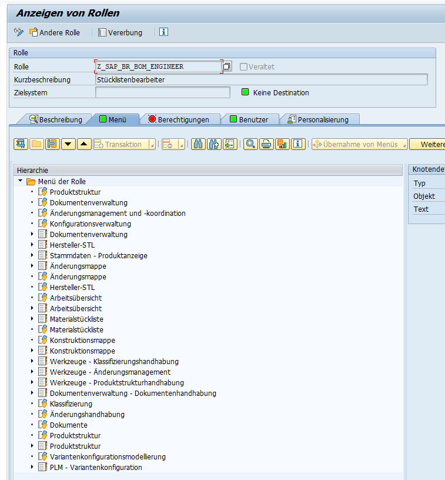
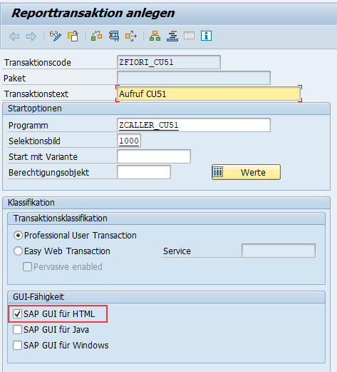
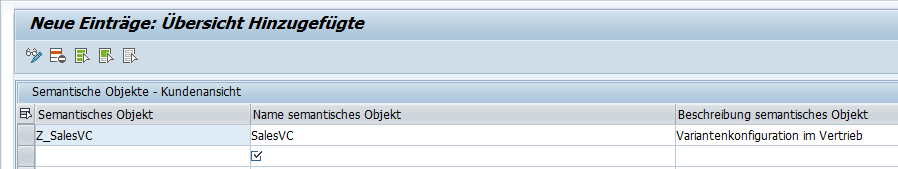
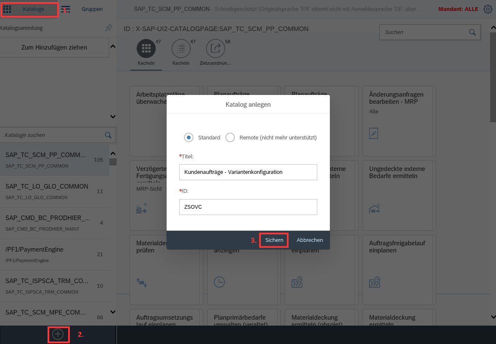

# SalesOrderItem manipulation via unmanaged RAP Scenario

* [Configure CU51 Call](#configure-cu51-call)
* [Maintain the roles](#maintain-the-roles)

Unmanaged RAP Example via VC for SalesDocumentItems

## Configure CU51 Call

### Maintain the roles

First step, before thinking about the call of an other application, is to check if this is available.
In our case, the T-Code CU51. Search for this in the [Fiori-App-Library](https://fioriappslibrary.hana.ondemand.com/sap/fix/externalViewer/) and find it [here](https://fioriappslibrary.hana.ondemand.com/sap/fix/externalViewer/#/detail/Apps('CU51')/S17OP).

Under `Implementation` &rarr; `Configuration` &rarr; `Business Role(s)` we find these two:


* SAP_BR_BOM_ENGINEER
* SAP_BR_PRODUCT_CONFIG_MODELER

Just copy this to a Z-role, for the possibilities of later adaption and assign this to the relevant Users.

Even if you have SAP_ALL, we need to assign this role, because of the contained menus in the role.



### Create Wrapper-Transaction

For calling the CU51, we need a "Wrapper-Transaction" with a short report, like the following:

```abap
*&---------------------------------------------------------------------*
*& Report ZCALLER_CU51
*&---------------------------------------------------------------------*
*&
*&---------------------------------------------------------------------*
REPORT zcaller_cu51.

PARAMETERS:
  p_vbeln TYPE vbeln_va,
  p_posnr TYPE posnr_va.

SET PARAMETER ID 'AUN' FIELD p_vbeln.
SET PARAMETER ID 'APO' FIELD p_posnr.
CALL TRANSACTION 'CU51' WITH AUTHORITY-CHECK AND SKIP FIRST SCREEN.
```

And next step, we need a transaction for it - something like `ZFIORI_CU51` for our report:



It's important, to mark the new transaction as available for **SAP GUI for HTML**.

### Create a semantic object

Before we go to the Fiori Launchpad, we first need to define a Semantic Object in classic SAP GUI via T-Code **/UI2/SEMOBJ**.



### Create navigation target

Next step, is creating the target for our navigation. Therefore we call either **/UI2/FLPD_CUST** or **/UI2/FLPD_CONF** - I personally prefer the last one, to maintain it client-independent.

If not already happened, we first have to create the catalog:



If you have any errors, then watch the appendix and hopefully find help there.

In the newly created catalog, we create a new target mapping for and we use therefore our semantic object.


## Appendix

### Prerequisites for Launchpad Customizing

In worst case, you wan to save the a new catalog and receive this "wonderful" message:

```txt
Error (500, ) in OData response for POST "/sap/opu/odata/UI2/PAGE_BUILDER_CONF/Catalogs": HTTP request failed
Details: Es ist eine Ausnahme aufgetreten.

Objekt kann ohne eine Entwicklungsklasse nicht angelegt werden
ID: /UI2/CX_WD_CFG_TOOL

Es ist eine Ausnahme aufgetreten
ID: /UI2/CX_RUNTIME

Es ist eine Ausnahme aufgetreten
ID: /IWBEP/CX_MGW_TECH_EXCEPTION
```

First to look for is the note [2581018 - Object cannot be created without a development class in Fiori Launchpad Designer](https://launchpad.support.sap.com/#/notes/2581018).